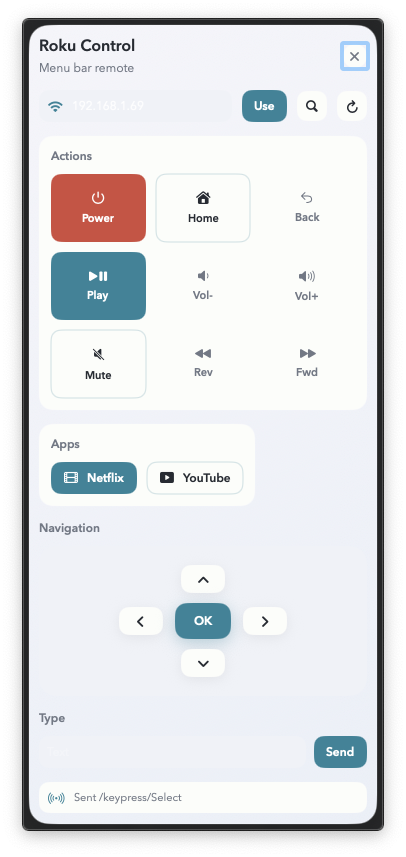

# Roku Box

Professional, menu bar control for Roku devices on your local network. Includes a SwiftUI macOS menu bar app and a simple CLI.



## Features

- Menu bar remote with power, transport, volume, D‑pad, and typing
- Quick app launch (Netflix, YouTube) with app ID fallback
- Auto‑discovery via SSDP + manual IP entry
- No external dependencies

## Requirements

- macOS 13+ for the menu bar app
- Roku setting: Settings → System → Advanced system settings → Control by mobile apps → Enabled
- Your computer and Roku on the same local network

## macOS Menu Bar App

Open the Swift package in Xcode:

1. Open `Package.swift` in Xcode.
2. Select the `RokuMenuBarApp` scheme.
3. Build & Run.

Usage:

- Click the menu bar icon to open the control panel under the icon.
- Use Auto‑Discover or enter the Roku IP and press Use.
- Actions, apps, navigation, and typing are available immediately.

## CLI

Discover devices:

```bash
./roku.py discover
```

Set target and query device info:

```bash
export ROKU_HOST=192.168.1.69
./roku.py info
```

List apps and launch one:

```bash
./roku.py apps
./roku.py launch 12
```

Common remote actions:

```bash
./roku.py keypress Home
./roku.py keypress Back
./roku.py keypress Up
./roku.py keypress Down
./roku.py keypress Left
./roku.py keypress Right
./roku.py keypress Select
./roku.py keypress Play
./roku.py keypress Rev
./roku.py keypress Fwd
```

Type text into a focused input field:

```bash
./roku.py type "hello world"
```

Auto‑discovery without setting `ROKU_HOST`:

```bash
./roku.py --auto info
```

## Troubleshooting

- `HTTP 403` means **Control by mobile apps** is disabled on the Roku.
- If auto‑discover fails, enter the IP manually.
- If commands do nothing, confirm the Roku and Mac are on the same subnet.

## Notes

- Roku device discovery uses SSDP multicast (239.255.255.250:1900) with search target `roku:ecp`.
- ECP commands are HTTP requests to `http://<roku-ip>:8060/`.
- Some ECP commands require developer mode; this app uses common, non‑developer commands.

## License

MIT. See `LICENSE`.
